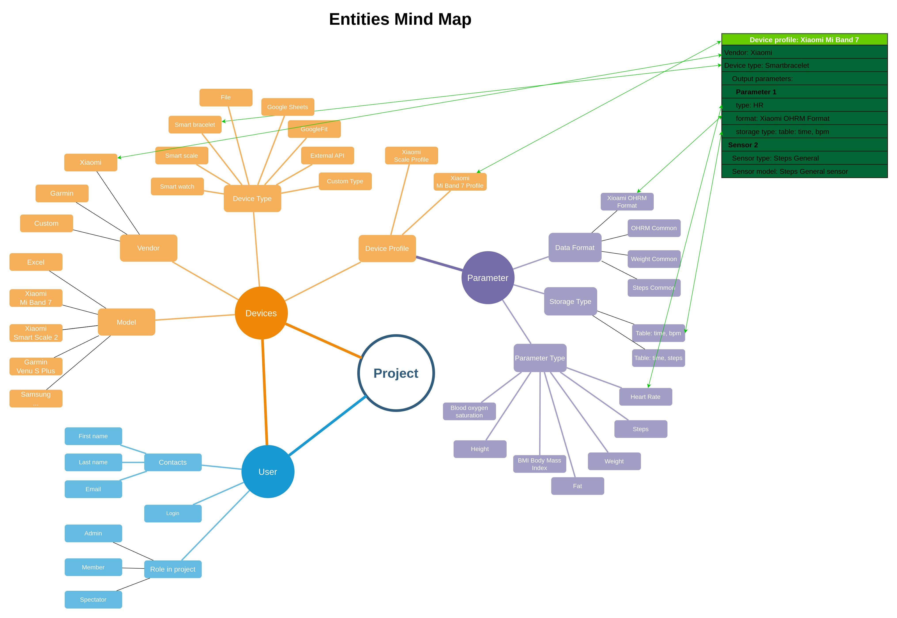
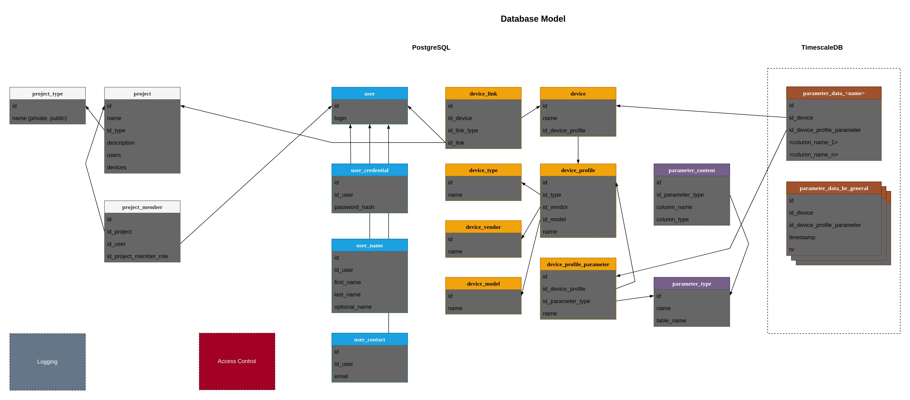

# Espira

A free health-tracking platform that you can deploy for yourself, your project, 
team or business. You decide which data to gather, store and analyze.

The project was inspired by [GadgetBridge](https://gadgetbridge.org)  and 
[openScale](https://github.com/oliexdev/openScale).

> MVP is still under development ...

- [Backend API](https://github.com/la-espira/espira_backend)
- [Mobile Frontend](https://github.com/la-espira/espira_mobile)

# Documentation

## Mind Map

- [Mind Map](doc/Entities-MindMap.drawio)

## Data Model

- [Logical Data Model](doc/Data_Model.Logical.drawio)

# Installation

...

# MVP version TODO

## Features

- [ ] Get data from wearable devices: smartwatch, smart bracelet.
- [ ] Load data from the mobile app to the cloud.

# Roadmap

## Features

- Import data from files
- Import data from Google Fit
- HTTP Sensor: get data from external source via HTTP(S) in JSON, YAML
